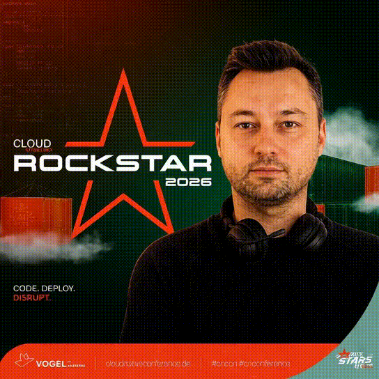
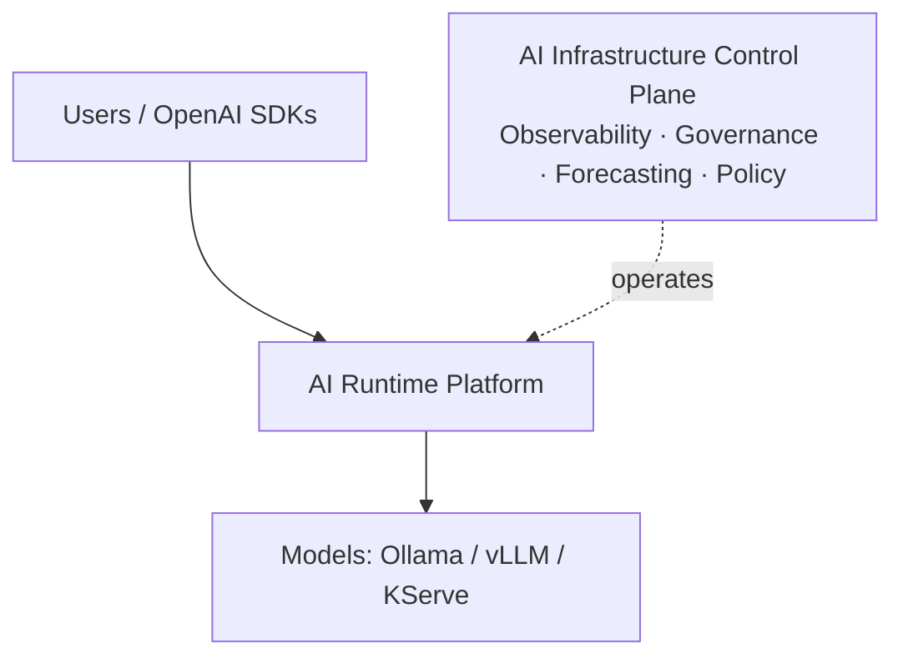

# 💫 About Me

Hi, I’m **Andrey** — a Platform Engineer and AI Infrastructure Architect focused on production-grade platforms for private AI workloads.

I combine Kubernetes, GitOps, Infrastructure as Code, Observability and AI Runtime Engineering to build secure, scalable and governable AI platforms.

🔧 I design **runtime and control-plane platforms** with Kubernetes, OpenTelemetry, KServe, vLLM, KEDA, Argo CD and Terraform.

🧠 Currently focused on AI inference routing, GenAI observability, cost governance, risk scoring and policy-driven operations.

> **"AI infrastructure should be observable, governable and boring in production."**

---

## 🏆 Recognition

[**Cloud Native Rockstar 2026**](https://www.cloudnativeconference.de/rockstars-2026)

  

---

## 🚀 What I Do

- 🧱 Build cloud-native and AI-native platforms with Kubernetes, GitOps and Infrastructure as Code
- 🧠 Design AI runtime layers for private LLM inference, routing, fallback and autoscaling
- 📡 Implement OpenTelemetry-based observability for infrastructure and GenAI workloads
- 🛡️ Build governance workflows for cost control, risk scoring, approvals and operational policy
- 🎯 Architect GitOps delivery with Argo CD, Argo Rollouts, Helm and Terraform

> ⚠️ Fun fact: the best infrastructure is still the one nobody notices during business hours.

---

## 🚀 AI Platform Portfolio

Two repositories demonstrate the complete operating model for private AI workloads:

### 🥇 [AI Runtime Platform](https://github.com/justrunme/ai-runtime-platform)

_Production-grade AI Runtime Layer for private LLM workloads._

- OpenAI-compatible APIs
- Runtime Decision Engine for request-time model selection
- Health-aware and cost-aware routing
- Canary deployments and fallback policies
- Ollama, vLLM and KServe integration
- KEDA autoscaling and GitOps deployment path
- OpenTelemetry GenAI telemetry

### 🥈 [AI Infrastructure Control Plane](https://github.com/justrunme/ai-infra-control-plane)

_Governance and Operations Platform for AI Infrastructure._

- AI observability and OpenTelemetry telemetry
- Forecasting and digital twin topology
- Cost governance and risk scoring
- Approval workflows and policy management
- Grafana, Loki and GitOps operations

Together, they show a complete AI Platform architecture: the Runtime Platform executes AI workloads, while the Control Plane observes, governs, predicts and controls them.

---

## 🧱 Previous Infrastructure Projects

Earlier hands-on work in cloud automation, GitOps, security and platform reliability:

### 🚀 Infrastructure & GitOps

- 🔄 **[Self-Healing Infrastructure with Chaos Engineering](https://github.com/justrunme/self-healing-infrastructure-chaos-engineering)**  
  _Kubernetes + LitmusChaos + Prometheus — auto-recovery pipelines and dashboards._

- 📦 **[GitOps Duel: ArgoCD vs Flux](https://github.com/justrunme/gitops-duel-argocd-vs-flux)**  
  _Side-by-side GitOps deployment comparison with ArgoCD and FluxCD on Kind._

- ☁️ **[Multi-Cloud IaC with Terraform + Terragrunt](https://github.com/justrunme/k8s-terraform)**  
  _Reusable infrastructure stacks across AWS and Azure using Terragrunt modules._

---

### 🛡️ Security & Observability

- 🔍 **[AWS Security Audit with Prowler](https://github.com/justrunme/prowler)**  
  _Automated scanning with Prowler + integration with Security Hub + GitHub Actions._

- 📊 **[Cloud-Native GitOps Platform with ArgoCD, Terraform, Monitoring & Security](https://github.com/justrunme/cloud-devops-platform)**  
  _Prometheus, Loki, Grafana and Jaeger setup with alerting and dashboards._

---

> 💡 Want more? Visit [github.com/justrunme?tab=repositories](https://github.com/justrunme?tab=repositories) for future experiments.

## 🤝 Let’s Work Together

🔭 **Open to collaboration** on:

- Platform Engineering / Developer Experience
- AI Infrastructure Architecture
- Private LLM Runtime Platforms
- GenAI Observability and Runtime Governance
- Kubernetes Operators / Controllers
- Cloud-native compliance & security
- Multi-cloud architecture (AWS / Azure / GCP)

🌍 [**Visit my Lab → Self-Healing Infrastructure with Chaos Engineering**](https://justrunme.github.io/self-healing-infrastructure-chaos-engineering/)  
_for tools, experiments, and ideas that shouldn't run as root._

---

## 🌱 Currently Building

- 🧠 **AI Runtime Decision Engines** for model routing, fallback, health and cost-aware inference
- 📡 **OpenTelemetry GenAI Observability** for traces, metrics and runtime-level AI signals
- 🧭 **AI Infrastructure Control Planes** for governance, forecasting, approvals and policy updates
- 🛡️ **Policy-Driven AI Governance** with OPA, Rego, Conftest and GitOps workflows
- 🛡️ **eBPF** for observability and zero-trust runtime security

---

## 💬 Ask Me About

- 🤖 AI Runtime Platforms, inference routing, KServe, vLLM and KEDA
- 📡 OpenTelemetry, GenAI observability, Grafana and Loki
- 🧭 AI governance, cost governance, risk scoring and approval workflows
- 🔄 GitOps, Helm, Argo CD, Argo Rollouts and Terraform
- ⚙️ CI/CD with GitHub Actions and GitLab CI
- 🛡️ Secure CloudOps and SRE practices
- 📬 Chat with me on [Telegram → @justrunme](https://t.me/justrunme)

---

## 🧰 Tech Stack Highlights

### 🤖 AI Platform Engineering

### 🧩 AI Platform Capabilities

### ☁️ Cloud & Container

### 🔧 IaC & GitOps

### 🔍 Observability & Security

### ⚙️ CI/CD & SCM

### 🧠 AI, Data & DB

### 🧑‍💻 Programming & Automation

### 📋 Project & Collaboration

---

## 📈 GitHub Stats

---

## 📟 Profile Counter

